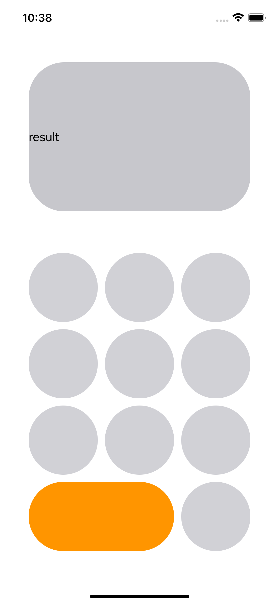
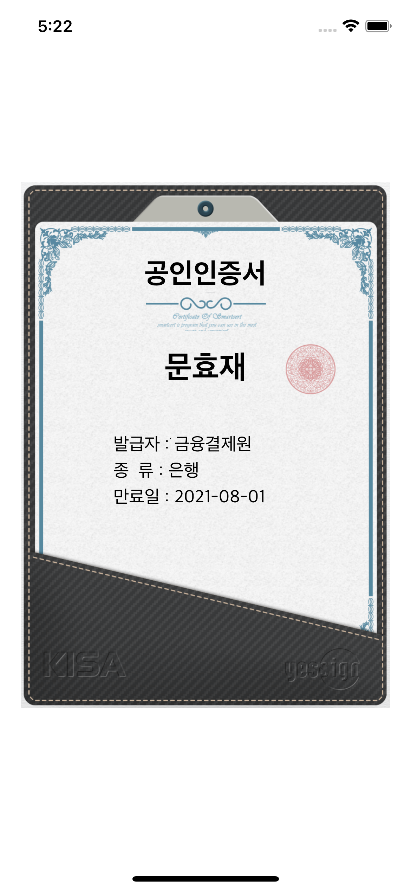
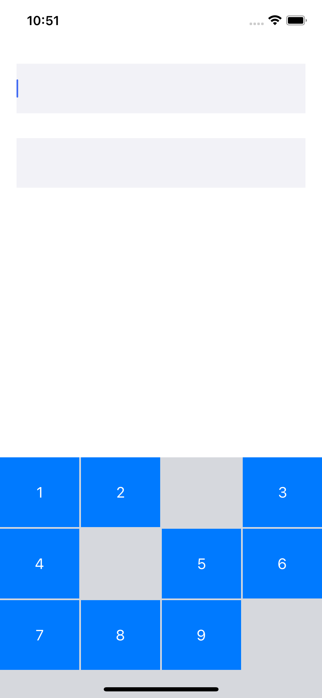
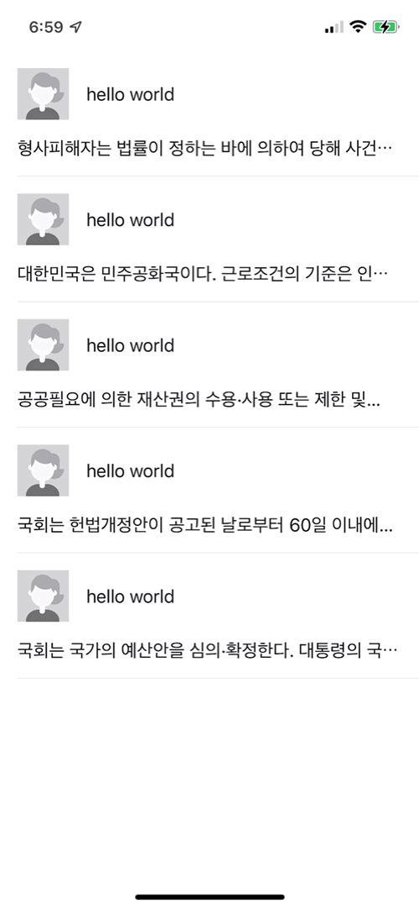
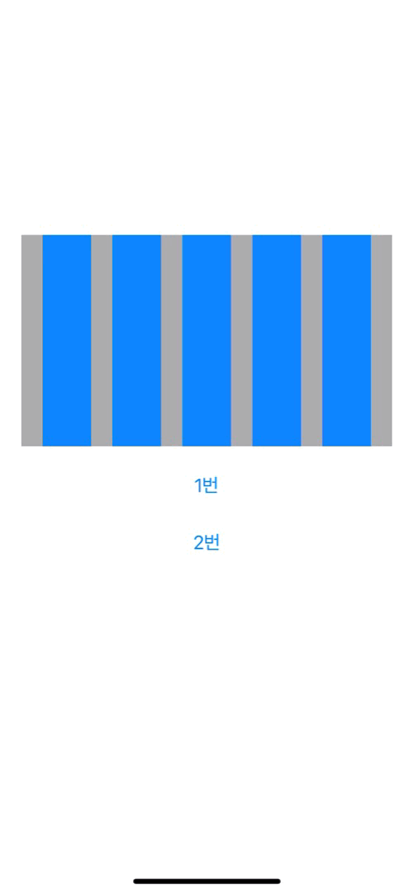
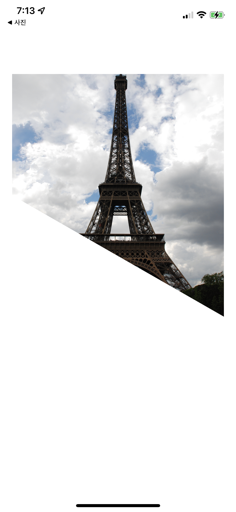
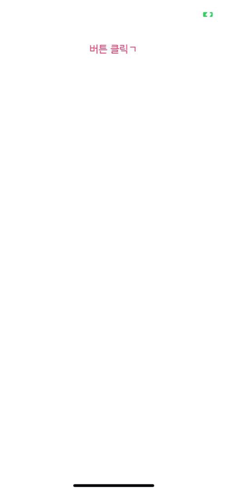

# AutolayoutPractice
✂️ SnapKit을 사용하여 인프런 iOS AutoLayout 강좌 실습

[🔗 인프런 강좌 링크 ](https://www.inflearn.com/course/autolayout/dashboard)

------

| **계산기 레이아웃** [CalculateViewController.swift](./AutolayoutPractice/CalculateViewController.swift) | **인증서 레이아웃** [CertViewController.swift](./AutolayoutPractice/CertViewController.swift) | **커스텀 키보드** [CustomKeyboardViewController](./AutolayoutPractice/CustomKeyboardViewController.swift) |
| :----------------------------------------------------------- | ------------------------------------------------------------ | ------------------------------------------------------------ |
|  |                       |             |
| - UIStackView  - StackView Constraint - Corner Radius | - AutoShrink Font - 비율에 따른 Constraint 적용         | - UIStackView - Custom Keyboard  - Protocol        |

| **커스텀 스위치** [CustomSwitchViewController.swift](./AutolayoutPractice/CustomSwitchViewController.swift) | **Expandable View** [ExpandableViewController.swift](./AutolayoutPractice/ExpandableViewController.swift) | **플로팅 버튼** [FloatingButtonViewController](./AutolayoutPractice/FloatingButtonViewController.swift) |
| :----------------------------------------------------------- | ------------------------------------------------------------ | ------------------------------------------------------------ |
|                     |                 |                   |
| - Update Constraint - Corner Radius - UIView Animation | - UITableView - UIView Animation - Reload TableView Data | - Update Constraint - UIView Animation - Blur Effect |

| **그래프** [GraphViewController.swift](./AutolayoutPractice/GraphViewController.swift) | **다각형 커스텀 뷰** [DiagonalViewController.swift](./AutolayoutPractice/DiagonalViewController.swift) | **팝업** [PopUpViewController](./AutolayoutPractice/PopUpViewController.swift) |
| :----------------------------------------------------------- | ------------------------------------------------------------ | ------------------------------------------------------------ |
|                      |                  |                      |
| - Update Constraint - UIView Animation                  | - BezierPath - CAShapeLayer                             | - Align Constraint - PresentationStyle / TransitionStyle  |

| **로그인 레이아웃** [SignInViewController.swift](./AutolayoutPractice/SignInViewController.swift) | **채팅 레이아웃** [ChatViewController.swift](./AutolayoutPractice/ChatViewController.swift) |
| :----------------------------------------------------------- | ------------------------------------------------------------ |
|                     |                       |
| - Update Constraint - 정규식 - addTarget Method    | - UITableView - Image Stretch - Notification - Keyboard Dismiss |

